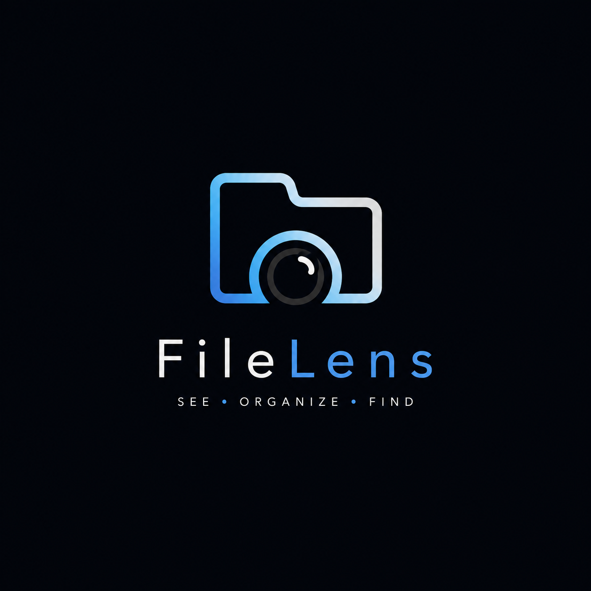

<p align="center">
  
</p>

<h1 align="center">FileLens</h1>

<p align="center">
  A visual workspace for everything on your PC
</p>

<p align="center">
  
  
  
  
</p>

---

## The Problem

Windows File Explorer forces you to remember exact folder paths. Over time, files scatter across dozens of directories, duplicates pile up, and finding anything becomes a chore. You know what you saved — you just don't remember where.

## The Solution

FileLens keeps your files exactly where they are and layers a fast, visual, intelligent workspace on top. Search by what you remember. Organize with tags and collections without moving a single file. See relationships between files. Understand your storage at a glance.

---

## Features

### Core

- **Fast Full-Text Search** — Powered by SQLite FTS5. Search by filename, extension, path, tags, or category in milliseconds.
- **Visual File Cards** — Images, PDFs, documents, and code rendered as rich previews instead of generic icons.
- **Multiple Views** — Grid, Compact, List, and Gallery modes. Switch instantly.
- **Tags** — Assign color-coded tags to any file. Filter across your entire library.
- **Collections** — Group files from different folders into virtual collections without moving or duplicating anything.
- **Favorites** — Pin important files for instant access.
- **File Details Panel** — See metadata, tags, related files, and perform actions without leaving the app.

### Organization

- **Duplicate Detection** — Identify potential duplicates by filename, size, and hash comparison.
- **Storage Analyzer** — Visual breakdown of disk usage by file category with drill-down.
- **File Relationships** — Link related files (source, export, version, attachment) and visualize project connections.
- **Recent Activity** — Track what you've been working on.

### Experience

- **Dark / Light / System Themes** — Automatic theme switching with a clean, modern UI.
- **Keyboard Shortcuts** — `Ctrl+K` search, `Ctrl+R` refresh, and more.
- **Quick Preview** — Press Space to preview files without opening external applications.
- **Custom Window Controls** — Frameless title bar with minimize, maximize, and close.
- **Background Indexing** — Indexes files asynchronously without blocking the UI.

### Privacy

- **100% Local** — No cloud uploads, no accounts, no telemetry. Your files never leave your machine.
- **Selective Indexing** — Choose exactly which folders to index. Exclude anything you want.
- **Offline First** — Every feature works without an internet connection.

---

## Screenshots

<table>
  <tr>
    <td></td>
    <td></td>
    <td></td>
  </tr>
  <tr>
    <td></td>
    <td></td>
    <td></td>
  </tr>
  <tr>
    <td></td>
    <td></td>
    <td></td>
  </tr>
  <tr>
    <td></td>
    <td></td>
    <td></td>
  </tr>
  <tr>
    <td></td>
    <td></td>
  </tr>
</table>

---

## Installation

### Download

Download the latest release from the [Releases](https://github.com/noturtrishanjit/filelens/releases) page.

Run `FileLens Setup 1.0.0.exe` and follow the installer.

### Build from Source

```bash
# Clone the repository
git clone https://github.com/noturtrishanjit/filelens.git
cd filelens

# Install dependencies
npm install

# Run in development mode
npm run dev

# Build the Windows installer
npm run build
```

### Requirements

- Windows 10 or Windows 11 (x64)
- Node.js 18+ (for building from source only)

---

## Tech Stack

| Layer | Technology |
|-------|-----------|
| Desktop Framework | Electron 32 |
| UI | React 18 + Vite |
| Database | SQLite via better-sqlite3 |
| Search Engine | SQLite FTS5 |
| File Indexing | Node.js fs + chokidar |
| Installer | NSIS via electron-builder |

---

## Project Structure

```
filelens/
├── src/
│   ├── main/                    # Electron main process
│   │   ├── index.js             # App entry, window management, IPC
│   │   ├── database.js          # SQLite schema and connection
│   │   ├── indexer.js           # File system scanning and indexing
│   │   ├── search.js            # FTS5 search, queries, storage analysis
│   │   └── preload.js           # Context bridge for renderer
│   ├── renderer/                # React frontend
│   │   ├── components/
│   │   │   ├── Sidebar.jsx      # Navigation sidebar
│   │   │   ├── TopBar.jsx       # Search bar and view controls
│   │   │   ├── Dashboard.jsx    # Home dashboard with stats
│   │   │   ├── FileView.jsx     # File grid/list rendering
│   │   │   ├── FileDetails.jsx  # Right panel file inspector
│   │   │   ├── QuickPreview.jsx # Space-to-preview modal
│   │   │   ├── TagsView.jsx     # Tag management
│   │   │   ├── CollectionsView.jsx
│   │   │   ├── StorageView.jsx  # Storage analyzer
│   │   │   ├── DuplicateView.jsx
│   │   │   ├── SettingsView.jsx # Theme and location settings
│   │   │   └── Welcome.jsx      # First-launch onboarding
│   │   ├── styles/
│   │   │   ├── themes.css       # Dark/light theme variables
│   │   │   └── components.css   # All component styles
│   │   └── App.jsx              # Root component, routing, state
│   └── shared/
│       └── constants.js         # File categories, defaults
├── build/
│   └── icon.ico                 # App icon
├── dist/                        # Vite renderer output
├── dist-installer/              # NSIS installer output
├── package.json
└── vite.config.js
```

---

## Database Schema

```
files           — Indexed file metadata (path, name, size, hash, category)
files_fts       — FTS5 virtual table for full-text search
tags            — User-defined tags with colors and icons
file_tags       — Many-to-many file ↔ tag relationships
collections     — Virtual file groupings
collection_files — Many-to-many collection ↔ file relationships
favorites       — Pinned files
relationships   — File-to-file links (source, export, version, etc.)
indexed_locations — Folders chosen for indexing
settings        — Key-value app preferences
activity_log    — Recent user actions
```

---

## Keyboard Shortcuts

| Shortcut | Action |
|----------|--------|
| `Ctrl+K` | Focus search bar |
| `Ctrl+R` | Refresh current view |
| `Space` | Quick preview selected file |
| `Enter` | Open file in default app |
| `Escape` | Close preview / modal |

---

## Performance

| Metric | Target |
|--------|--------|
| Startup | < 2 seconds |
| Search (indexed) | < 500ms |
| Large libraries | 500,000+ files |
| UI | 60 FPS scrolling |

---

## Roadmap

### v1.1
- [ ] Timeline view
- [ ] Smart collections (recently added, large files, unused)
- [ ] File relationship graph visualization
- [ ] Project workspaces
- [ ] Advanced search filters

### v1.5
- [ ] Local AI semantic search
- [ ] Automatic tag suggestions
- [ ] Saved searches
- [ ] Custom dashboards

### v2.0
- [ ] Cross-device metadata sync
- [ ] Mobile companion app
- [ ] File automation rules
- [ ] Smart workspaces

---

## Contributing

Contributions are welcome. Please open an issue first to discuss what you'd like to change.

```bash
git checkout -b feature/your-feature
npm run dev
# Make changes
npm run build
```

---

## License

MIT License. See [LICENSE](LICENSE) for details.

---

## Acknowledgments

Built with [Electron](https://electronjs.org), [React](https://react.dev), [Vite](https://vitejs.dev), [better-sqlite3](https://github.com/WiseLibs/better-sqlite3), and [electron-builder](https://www.electron.build).
